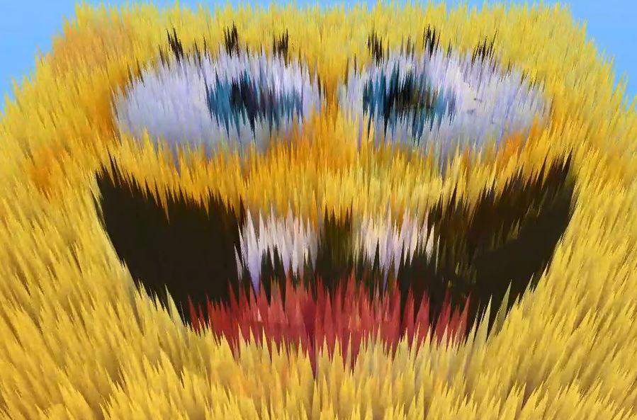

# unity-optimized-grass
Optimized 3D grass for unity that works on Mobile. OpenGL 3.5+

## Demo Video

## How to use
There's a demo scene in the assets. Run it and click on the screen. Open up an issue if there's anything wrong.
**Remember to set the priority to OpenGL instead of Vulkan in the player settings**

## Features

* Fast
* Custom Textures
* Custom Cut Particle
* Custom Wind
* Open Source :)
* Works Perfectly on Mobile

# If it's helpful consider giving it a star
